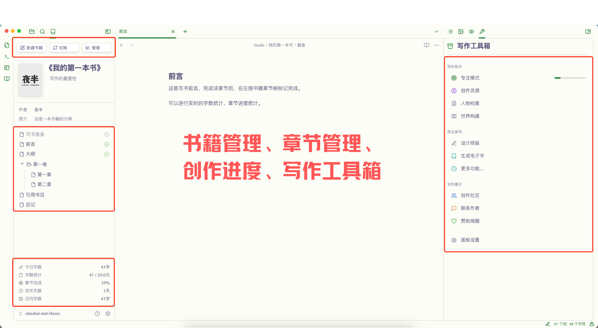
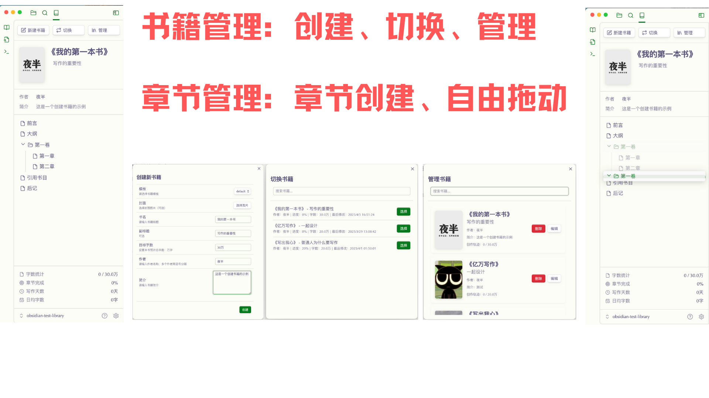
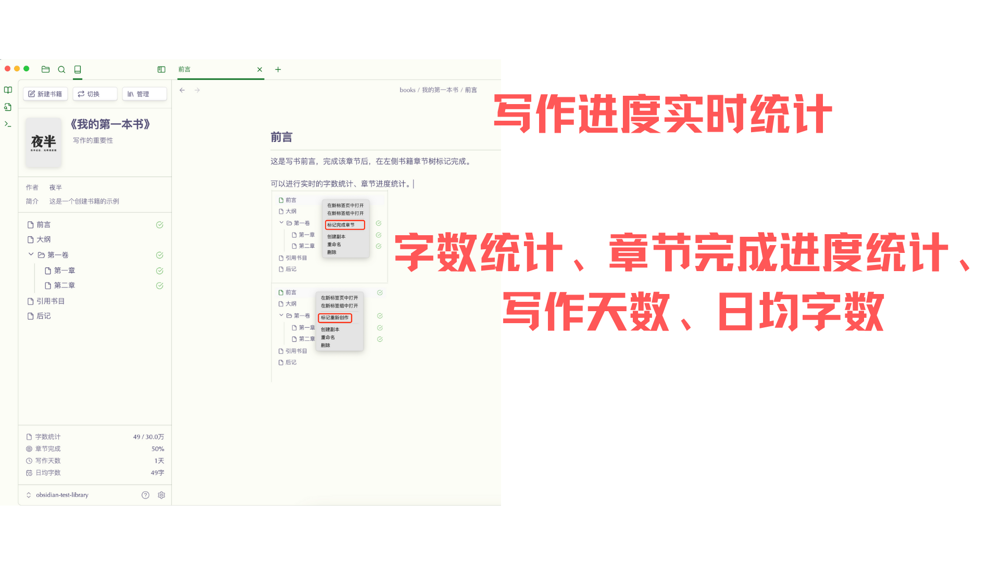
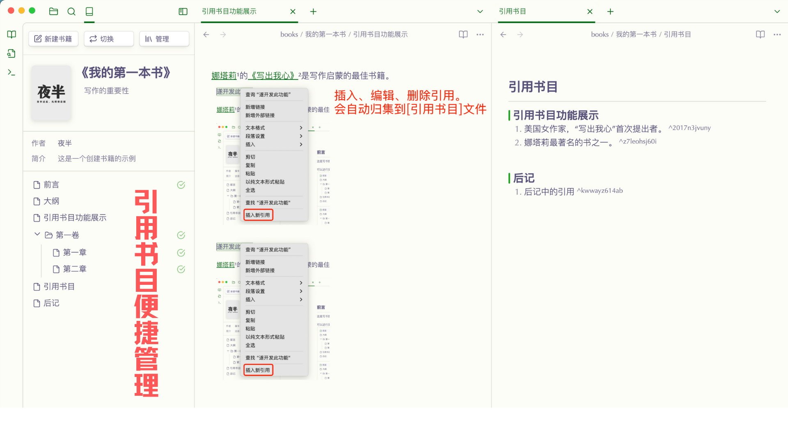

# Book Smith

Book Smith is a writing management plugin designed for Obsidian, helping authors better organize and manage their writing projects.

   

[简体中文](README.md) | English

## 功能演示
<!-- 插图展示 -->

  
  
  
  

## Features

- 📚 Book Project Management
  - Create and manage multiple book projects
  - Support custom book templates
  - Custom cover images
  - Basic information management
- 📑 Chapter Management
  - Tree structure display
  - Drag-and-drop sorting
  - Chapter status marking
  - Flexible folder organization
- 📊 Writing Statistics
  - Real-time word count
  - Writing progress tracking
  - Daily writing volume statistics
  - Goal completion analysis
- 🎯 Focus Writing
  - Pomodoro technique
  - Customizable work/break duration
  - Writing data tracking
  - Interruption statistics and analysis
- 📝 Reference Management
  - Quick reference creation
  - Automatic numbering system
  - Bibliography generation
  - Reference search
- 📤 Export: Support multiple formats

## Usage

### Basic Usage
1. After installation, a book management icon will appear in the left sidebar
2. Click "New Book" to create your first book
3. In the book management interface, you can:
   - Create/edit chapters
   - Manage book information
   - View writing statistics

### Reference Management
1. Select text to create new references
2. Use right-click menu to manage references
3. Automatically generate bibliography
4. Quick search existing references

### Focus Writing
1. Click the focus mode icon to enter focus writing
2. Set work duration and break time
3. Start focused writing
4. View writing data and progress

## Installation

### From Obsidian Community Plugins (Recommended)
1. Open Obsidian Settings
2. Go to Third-party Plugins
3. Disable Safe Mode
4. Click Browse Community Plugins
5. Search for "Book Smith"
6. Click Install and Enable

### Manual Installation
1. Download the latest release: https://github.com/Yeban8090/book-smith/releases
2. Extract and copy the folder to Obsidian plugins directory: `{vault}/.obsidian/plugins/`
3. Restart Obsidian
4. Enable the plugin in Settings

## Configuration

### Basic Settings
- Default author information
- Book storage path settings

### Template Settings
- Default template selection
- Template management
- Custom templates
- Template structure
- Template description

### Focus Mode Settings
- Work duration adjustment
- Break time settings
- Notification preferences
- Statistics rules configuration

## Tips
- Use templates to quickly create common book structures
- Regularly backup your book data
- Use statistics to set daily writing goals
- Use reference features to manage research materials
- Try different export formats for various publishing needs
- Use drag-and-drop to organize chapter structure
- Use chapter status markers to track progress
- Improve writing efficiency with focus mode

## Cross-platform Support
- Full desktop support
- Optimized mobile experience
- Automatic data synchronization
- Consistent user experience

## Supported Languages
The plugin interface currently supports:
- Simplified Chinese
- English

## Support The Author
If this plugin helps you, consider buying me a coffee ☕:

  

    

      <strong>微信支付</strong> 
      
    

    

      <strong>支付宝</strong> 
      
    

    

      <strong>Buy Me a Coffee</strong> 
      
    

  

Your support motivates me to keep improving this plugin!

## License
MIT License. See [LICENSE](LICENSE) for more information.

## Author
Yeban

## Feedback and Support
If you encounter any issues or have suggestions, feel free to submit an issue on GitHub.